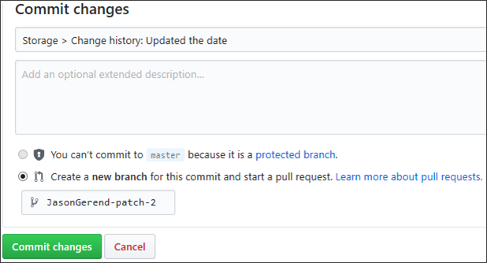

# Update existing Windows Server and Azure Stack HCI articles using a web browser and GitHub

There are two separate locations where we keep Windows Server technical content. One of the locations is public (`windowsserverdocs`) while the other is private (`windowsserverdocs-pr`). Who you are determines which location you contribute to:

- **I'm not a Microsoft employee.** As a non-Microsoft employee, you must contribute to the public location. For information about how to do that, see the [Contributing.md](https://github.com/MicrosoftDocs/windowsserverdocs/blob/master/CONTRIBUTING.md) file.

- **I'm a Microsoft employee.** As a Microsoft employee, you have options, based on what you're trying to do:

    - **Create a brand-new article.** To create a brand-new article, you must create and set up your GitHub account and tools, fork and clone the `windowsserverdocs-pr` repo, set up your remote branch, create the article, and finally create a new pull request for approval and publishing. For these instructions, see the [Create new Windows Server articles using GitHub and Visual Studio Code](create-new-using-github.md) article.

    - **Make large changes to an existing article.** To make substantial changes to an existing article, you can follow the instructions in the [Edit an existing Windows Server article using GitHub and Visual Studio Code](edit-existing-using-github.md) article.

    - **Make minor changes to an existing article.** To make minor changes to an existing article, follow the instructions in this article.

  > [!IMPORTANT]
  > All repositories published to Microsoft Docs have adopted the [Microsoft Open Source Code of Conduct](https://opensource.microsoft.com/codeofconduct/) or the [.NET Foundation Code of Conduct](https://dotnetfoundation.org/code-of-conduct). For more information, see the [Code of Conduct FAQ](https://opensource.microsoft.com/codeofconduct/faq/). Or contact [opencode@microsoft.com](mailto:opencode@microsoft.com), or [conduct@dotnetfoundation.org](mailto:conduct@dotnetfoundation.org) with any questions or comments.
  >
  > Minor corrections or clarifications to documentation and code examples in public repositories are covered by our [Terms of use](/legal/termsofuse). New or significant changes generate a comment in the pull request, asking you to submit an online Contribution License Agreement (CLA) if you are not an employee of Microsoft. We need you to complete the online form before we can review or accept your pull request.

## Quick edits to existing articles using GitHub and a web browser

Quick edits streamline the process to report and fix small errors and omissions in documents. Despite all efforts, small grammar and spelling errors _do_ make their way into our published documents.

1. Follow the instructions in [GitHub account setup](https://review.learn.microsoft.com/help/contribute/contribute-get-started-setup-github?branch=main).

1. Go to the [Windows Server](https://github.com/MicrosoftDocs/windowsserverdocs-pr/tree/master/WindowsServerDocs) or [Azure Stack HCI](https://github.com/MicrosoftDocs/azure-stack-docs-pr/tree/master/azure-stack/hci) private repository. The private repositories are monitored more frequently so our approval time is faster, they benefit from increased quality checks, and provide the ability to view content in staging as it will appear on our live site.

1. Navigate to the article you want to edit, and then select the **Edit this file** button.

   

1. Edit the topic, then scroll down to the bottom, briefly describe the changes, and then select **Commit changes**.

    

## Submit the pull request

After you create your pull request, you must submit it for approval and publishing.

### To submit your pull request

1. On the **Open a pull request** page, update your commit message to make it more appropriate for a PR. For example: Fix typo in first paragraph.

2. Make sure that only the commits and files you expect to be included are included. Also check that the PR goes to the correct branch in the upstream repository, either master (typically) or a release branch (occasionally).

3. In the **Reviewers** area of the right pane, select the gear icon, and then enter _windowsservercontent_. A member of the alias will be on point to review your changes and either merge your pull request or add comments about things to change before merging.

4. Select **Create pull request**. The new PR is linked to your working branch in your fork. Until the PR is merged, any new commits you push to the same working branch in your fork are automatically included in the PR. A new label is added to your pull request that says, **do-not-merge**. This simply means that your content is still in progress and shouldn't be reviewed or pushed to the live site.

5. When you're ready for someone from the alias to review your content, you must add the text, **#sign-off** to the comments. This comment:

    - Updates the label for your pull request from **do-not-merge** to **ready-to merge**.

    - Lets the alias and writers know that you're ready to have your content reviewed.

    - Lets the admins know that after approval, your content is ready go live.
